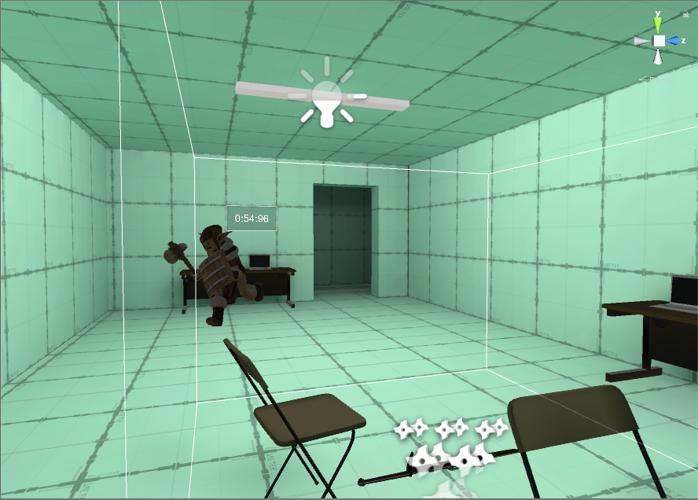

# OptitrackDemo
Created by Garrett Tvedt, Pedro Marquez, and Jung Ha

Quick Demonstration of Optitrack outside-in tracking working simultaneously with SteamVR in Unity Using VRP2Unity

Real world objects are tracked using outside-in tracking, then, when a real world item is moved, it is likewise moved in the game world.

This novel interaction method allows for the weight of an object to add a stronger sense of kinesthetic movement.

# The Game
The player with a steamVR is sent into a virtual lab room where they can fight invading monsters using a hammer, magic sword, or magic staff.

# Environment Layout
